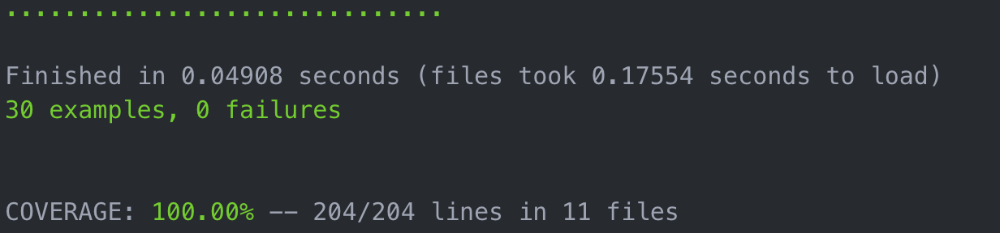
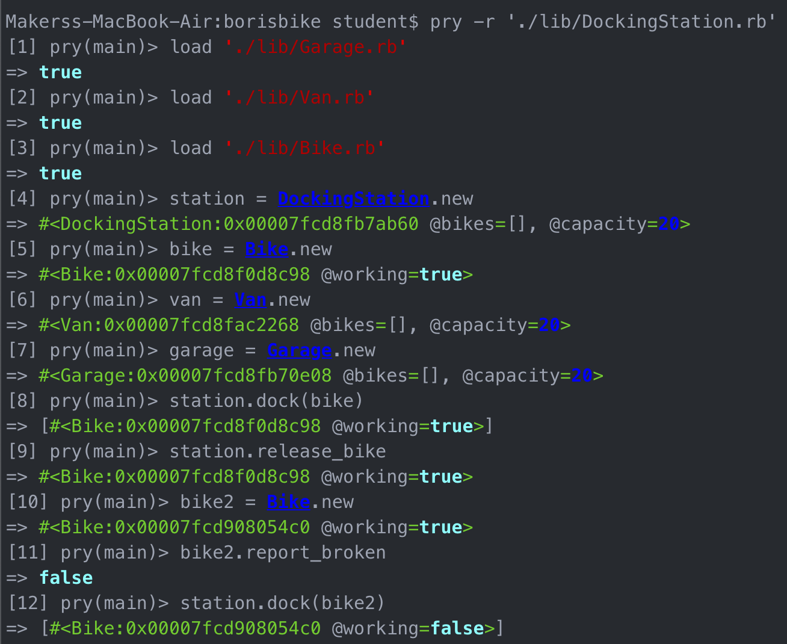

# Boris Bikes

A system for the Boris Bikes of London, users can dock and hire bikes from docking stations.

## Setting up

### Cloning the repository

To clone the repository, navigate to the path that you would like the repository to be stored and type the following:

`git clone https://github.com/Jamie95187/borisbikes.git`

After cloning the repository enter the root directory for the project

`cd borisbikes`

### Installing the gems

Use the following command to install the gems:

`bundle install`

## Testing

For the unit testing, you can type `rspec` in the root directory for this project. The test coverage is shown in the terminal when typing `rspec`.



Feature tests can be run on an online repl, `irb` or `pry` in terminal. Refer to the image below to see how to feature test in `pry`



Used rubocop as linter. This can be used by typing `rubocop` in the project's root directory.

 A 95%+ test coverage was achieved for this project.

### Gems used

pry - alternative to irb (used for feature testing the system) <br
rspec - used for unit testing the model <br>
rubocop - linter used to write conventional ruby <br>
simplecov - to calculate test coverage over the project <br>
simplecov-console - to display the coverage onto the terminal

## User Stories & Domain Models
```
As a person,
So that I can use a bike,
I'd like a docking station to release a bike.

As a person,
So that I can use a good bike,
I'd like to see if the bike is working.

As a member of the public
So I can return the bikes I've hired
I want to dock my bike at the docking station

As a member of the public
So I can decide whether to use the docking station
I want to see if the bike has been docked

As a member of the public
So that I am not confused and charged unnecessarily.
I'd like docking stations to not release bikes when there are none available.

As a maintainer of the system
So that I can control the distributions of bikes
I'd like docking stations not to accept more bikes than their capacity.

As a system maintainer
So that I can plan the distributions of bikes
I want a docking station to have a default capacity of 20 bikes

As a system maintainer
So that busy areas can be served more effectively
I want to be able to specify a larger capacity when necessary.

As a member of the public
So that I reduce the chance of getting a broken bike in the future
I'd like to return a broken bike when I return it

As a maintainer of the system
So I can manage broken bikes and not disappoint the users
I'd like docking stations to not release broken bikes

As a maintainer of the system
So I can manage broken bikes and not disappoint the users
I'd like the docking stations to accept returning bikes (broken or not).

As a maintainer of the system
So that I can manage broken bikes and not disappoint users
I'd like vans to take broken bikes from the docking stations and deliver them to garages to be fixed.

As a maintainer of the system
So that I can manage broken bikes and not disappoint users
I'd like vans to collect working bikes from garages and distribute them to docking stations.
```
## Bike

| **Object** | **Messages** | **What it does** |
|--- | --- | --- |
| Bike | working? | checks the bike works |
| | report_broken | report the bike is broken |
| | fix | fixes the broken bike |

## Docking Station

| **Object** | **Messages** | **What it does** |
|--- | --- | --- |
| Docking Station | dock_bike | docks a bike |
| | release_bike | releases a bike |
| | get_broken_bike | gets a broken bike |

## Van

| **Object** | **Messages** | **What it does** |
|--- | --- | --- |
| Van | load | loads broken bikes into the van |
| | unload | unloads broken bikes into the garage |
| | populate_garage | populates the garage with broken bikes|
| | get_fixed_bikes | gets the fixed bikes from the garage |
| | distribute | distributes the fixed bikes back to the station |

## Garage

| **Object** | **Messages** | **What it does** |
|--- | --- | --- |
| Garage | fix_bikes | fixes the broken bikes |

## BikeContainer (Module)
This module is a mixin for the Garage, Van, and DockingStation classes.

| **Method** | **What it does** |
| --- | --- |
| initialize | sets a max capacity for the object |
| add_bike | add a bike to the object |
| remove_bike | remove bike from the object |
| empty? | checks if the object is empty |
| full? | checks if the object is at max capacity |
